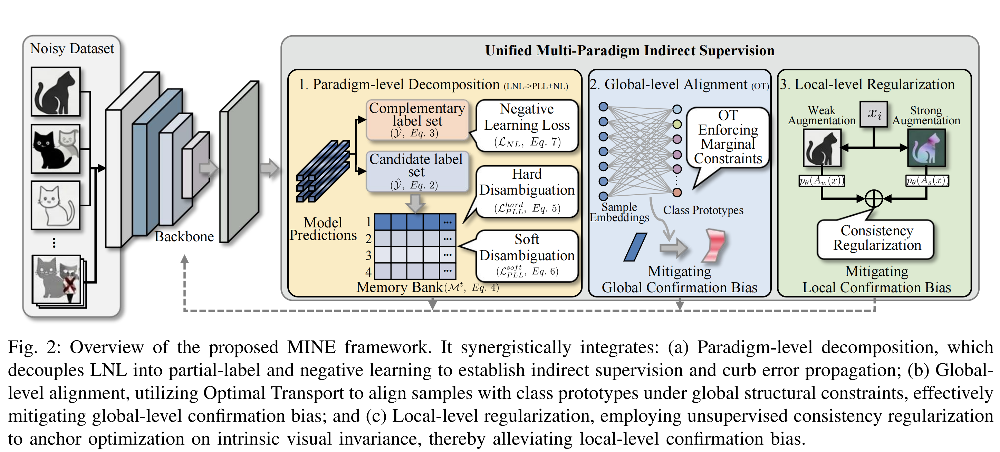
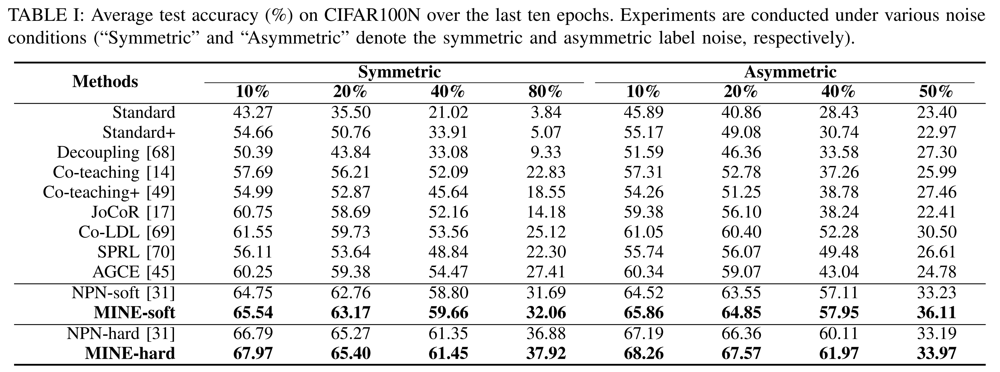
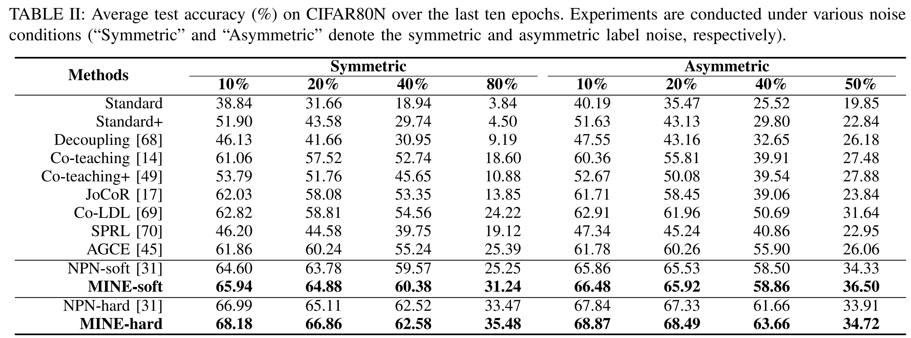
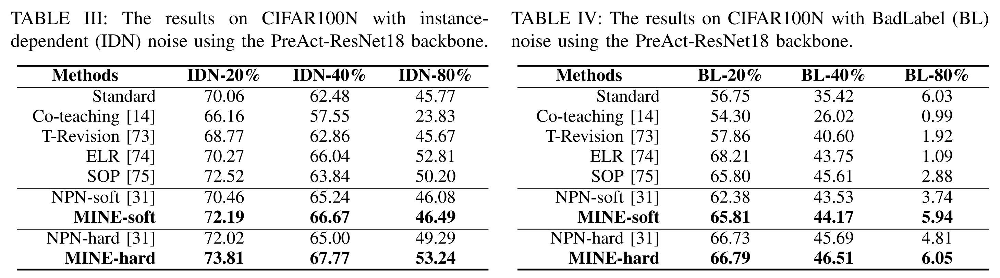
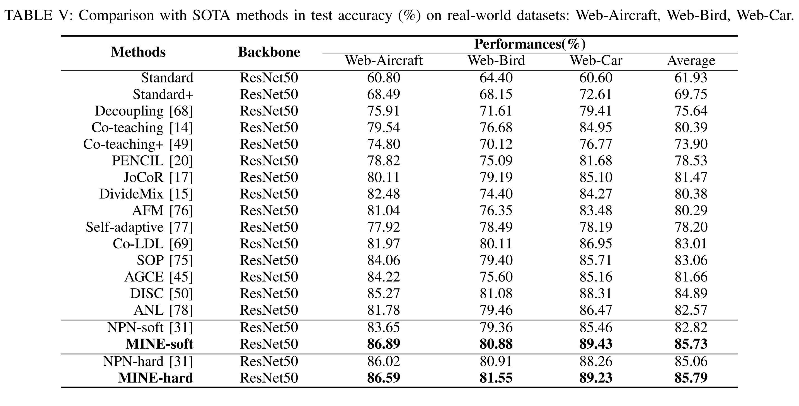
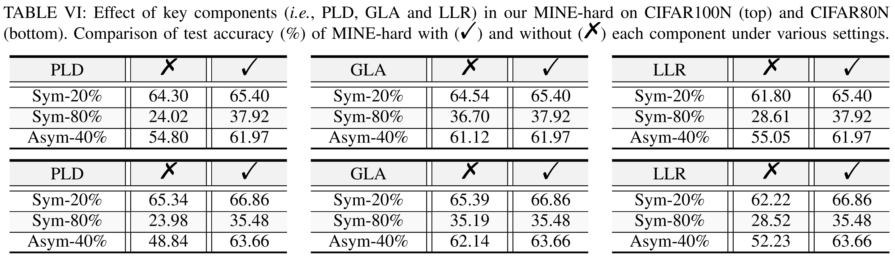

# MINE: Unified Multi-Paradigm Indirect Supervision for Robust Label-Noise Learning
**Abstract:** Deep neural networks are highly vulnerable to mislabeled data, a pervasive issue in large-scale datasets collected via automated web crawling. Existing label-noise learning (LNL) methods typically attempt to extract reliable supervision from corrupted annotations, yet this direct reliance induces dual-level confirmation biases: at the instance level, ambiguous samples are overfit, and at the class level, easier categories dominate learning, collectively distorting the optimization trajectory. To the end, we propose Multi-paradigm INirect supErvision (MINE), a noise-tolerant framework that alleviates reliance on unreliable labels by decomposing learning into complementary indirect supervision signals. Concretely, we reformulate LNL through a principled label-space decomposition, integrating partial-label learning and negative learning to constrain the prediction space without enforcing exact label matching. Building on this, we introduce a global alignment mechanism via optimal transport to enforce structurally consistent label assignments, and a local consistency regularization scheme to anchor representation learning on intrinsic visual invariance. By unifying these indirect supervision paradigms, MINE effectively mitigates both local- and global-level confirmation biases, circumventing the error-reinforcing cycles that plague conventional methods. 
Extensive experiments on synthetic and real-world noisy datasets demonstrate that MINE consistently outperforms state-of-the-art approaches, particularly under extreme noise conditions.

# Pipeline


# Installation
```
pip install -r requirements.txt
```

# Datasets
We conduct noise robustness experiments on a synthetically corrupted dataset (i.e., CIFAR100N and CIFAR80N ) and three real-world datasets (i.e., Web-Aircraft, Web-Car and Web-Bird).
Specifically, we create the noisy dataset CIFAR100N and CIFAR80N based on CIFAR100.
We adopt four noise structures: symmetric, asymmetric, instance-dependent and BadLabel noise, with a noise ratio $n \in (0,1)$.

You can download the CIFAR10 and CIFAR100 on [this](https://www.cs.toronto.edu/~kriz/cifar.html).

You can download Web-Aircraft, Web-Car, and Web-Bird from [here](https://github.com/NUST-Machine-Intelligence-Laboratory/weblyFG-dataset).

# Training

An example shell script to run MINE-hard on CIFAR-100N :

```python
python MINE-hard.py --gpu 7  --warmup-epoch 200 --epoch 300 --batch-size 128 --lr 0.01 --warmup-lr 0.05  --noise-type symmetric --closeset-ratio 0.1 --lr-decay cosine:200,5e-5,300 --opt sgd --dataset cifar80no --topk 2 --log MINE-hard

```
An example shell script to run MINE-soft on CIFAR-100N :

```python
python MINE-hard.py --gpu 7  --warmup-epoch 200 --epoch 300 --batch-size 128 --lr 0.01 --warmup-lr 0.05  --noise-type symmetric --closeset-ratio 0.1 --lr-decay cosine:200,5e-5,300 --opt sgd --dataset cifar80no --topk 2 --log MINE-soft
```


# Results on CIFAR100N:



# Results on CIFAR80N:



# Results on CIFAR100N with instance-dependent (IDN) noise:



# Results on CIFAR100N with BadLabel (BL) noise:



# Results on Web-Aircraft, Web-Bird, and Web-Car:




# Effects of different components in test accuracy (%):


